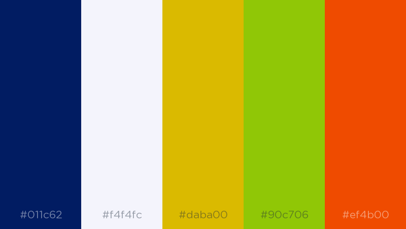

# HireLogic

###### INSTALL dependencies, start changes WATCH and SERVE locally.
`npm start`

###### SERVE locally and WATCH files changes
`npm run dev`

###### Create PRODUCTION BUILD
`npm run prod`

------------

### Color Palett

------------

### File structure
┌ **src** (sources directory)\
├── **assets** (assets directory)\
├──── **images**\
├────── **icons**\
├────── **favicon**\
├──── **fonts**\
├──── **audio**\
├──── **video**\
├──── **data** (for json|txt|md data)\
├ **components** (main structural components)\
├ **global** (simple elements like button|input|textarea, global elements like icons and other main styles and js)\
├ **pages** (pages layouts and additional scripts and styling)\
├ **views** (complex repeatable elements based on multiple components)\
├ **live** (current development build)\
├ **public** (production build)\
├ package.json (main project config)\
├ gulpfile.babel.js (main building tool config)\
└ webpack.config.js (es6)

------------
